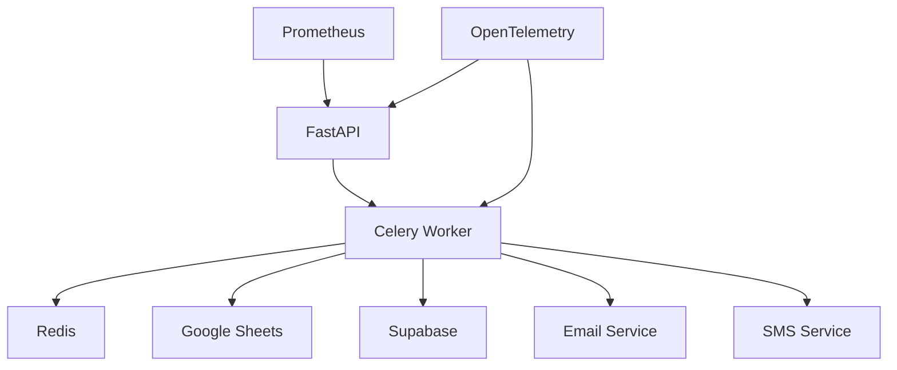

# Lead Follow-up Service

Enterprise-grade lead management and follow-up automation service.

## Architecture



### Components

- **API** (`app.main`): FastAPI application with health checks and metrics
- **Scheduler** (`app.scheduler`): Enqueues tasks via Celery chord
- **Services**:
  - `batch_processor`: Handles batched updates to Google Sheets
  - `google_sheets`: Manages Google Sheets integration
  - `email_service`: Handles email notifications
  - `sms_service`: Manages SMS communications
  - `supabase_service`: Handles data persistence
  - `timezone_utils`: Timezone management
- **Core**:
  - `constants`: Application constants
  - `decorators`: Retry and other decorators
  - `tracing`: OpenTelemetry setup
- **Utils**:
  - `date_utils`: Date formatting helpers
  - `redis_utils`: Redis connection management
- **Models**:
  - `lead`: Lead data model

## Setup

1. **Environment Variables**

   Copy `.env.example` to `.env` and fill in:

   ```bash
   cp .env.example .env
   ```

   Required variables:

   - `SHEET_ID`: Google Sheets ID
   - `GOOGLE_CREDENTIALS`: Service account JSON
   - `EMAIL_API_KEY`: Email service API key
   - `KIXIE_API_KEY`: SMS service API key
   - `SUPABASE_URL`: Supabase project URL
   - `SUPABASE_KEY`: Supabase API key

2. **Local Development**

   ```bash
   # Start services
   make up

   # Run tests
   make test

   # Run linting
   make lint
   ```

3. **Docker Deployment**

   ```bash
   # Build image
   docker build -t lead-followup .

   # Run container
   docker run -p 8000:8000 --env-file .env lead-followup
   ```

## API Documentation

- **OpenAPI**: Available at `/docs` when running
- **Health Check**: `GET /health`
- **Metrics**: `GET /metrics` (Prometheus format)

## Development

### Prerequisites

- Python 3.11+
- Redis
- Docker (optional)

### Commands

```bash
# Install dependencies
pip install -r requirements.txt

# Run tests
pytest

# Run linting
black .
flake8
mypy .

# Start services
docker-compose up
```

### Testing

```bash
# Run all tests
pytest

# Run with coverage
pytest --cov=app

# Run specific test
pytest tests/test_batch_processor.py
```

## Monitoring

- **Metrics**: Prometheus metrics at `/metrics`
- **Tracing**: OpenTelemetry spans
- **Logs**: JSON-structured logging

## Contributing

1. Fork the repository
2. Create a feature branch
3. Commit your changes
4. Push to the branch
5. Create a Pull Request

## License

MIT
